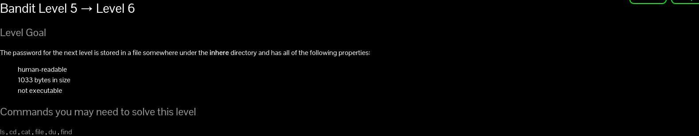

# Bandit
login:- ssh bandit0@bandit.labs.overthewire.org -p 2220

//change the level number
<h2>Level 1</h2>

passwrd by writing cat readme

<b>NH2SXQwcBdpmTEzi3bvBHMM9H66vVXjL</b>

exit -d 

to exit this
and 
login:- ssh bandit1@bandit.labs.overthewire.org -p 2220
<h2>Level 2</h2>

When we do cat - 
Problem occurs as  
<b>Handling a Filename Starting with a Dash (-)</b>

Sometimes you can slip and create a file whose name starts with a dash (-), like -output or -f. That's a perfectly legal filename. The problem is that UNIX command options usually start with a dash (-). If you try to type that filename on a command line, the command might think you're trying to type a command option.

In almost every case, all you need to do is "hide" the dash from the command. <b>Start the filename with ./ (dot slash)</b>. This doesn't change anything as far as the command is concerned; ./ just means "look in the current directory" (1.21). So here's how to remove the file -f:
Therefore command written is:
~$ cat ./-
prints:-
rRGizSaX8Mk1RTb1CNQoXTcYZWU6lgzi
<h2>Level 3</h2>

Read a File with spaces in filename

You can use 'cat' command or open the document using your preferred text editor such as vim, nano or gedit.

cat 'personal docs'

Alternatively, you can use the syntax below

cat file\ name\ with\ spaces

Password:-<b>aBZ0W5EmUfAf7kHTQeOwd8bauFJ2lAiG</b>

<h2>Level 4</h2>

**find command used**

The find command in Linux is a dynamic utility designed for comprehensive file and directory searches within a hierarchical structure. 

find ./"directory name"

searches for all the files and returns their name also returns the file that were hidden

searches and returns all file names in the current directory

logs:

bandit3@bandit:\~*\$ ls 
inhere 
bandit3@bandit:\~*\$ cd inhere 
bandit3@bandit:\~*\/inhere$ ls 
bandit3@bandit:\~*\/inhere$ find 
. 
./.hidden 
bandit3@bandit:\~*\/inhere$ cat ./.hidden 
2EW7BBsr6aMMoJ2HjW067dm8EgX26xNe 
bandit3@bandit:\~*\/inhere$ #or 

bandit3@bandit:\~*\/inhere$ cd ~/ 
bandit3@bandit:\~*\$ find ./inhere 
./inhere 
./inhere/.hidden 
bandit3@bandit:\~*\$ cat ./inhere/.hidden 
2EW7BBsr6aMMoJ2HjW067dm8EgX26xNe 
bandit3@bandit:\~*\$  

Password:-<b>2EW7BBsr6aMMoJ2HjW067dm8EgX26xNe</b>

<h2>Level 5</h2>

you can use du to get size on drive,which is same,

use <b>ls -l</b> to get size ,file type which is same for eveything here
 
 so in the end I tried file ./-file00 
 o/p:./-file00: data
//./- as name hd - in it

same for all except -file07 which was an ascii text file

Password:lrIWWI6bB37kxfiCQZqUdOIYfr6eEeqR

alternate solutions
for loop in linux for file type 
or  
cat each file and get meaningful data only in -file07

<h2>Level 6</h2>
