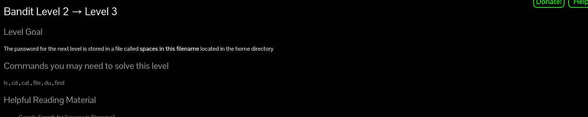
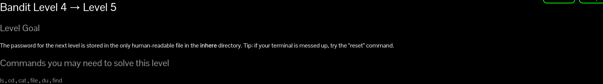
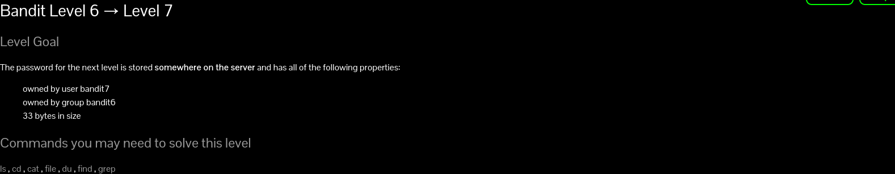

# Bandit
login:- ssh bandit0@bandit.labs.overthewire.org -p 2220

//change the level number
<h2>bandit0</h2>

passwrd by writing cat readme

<b>NH2SXQwcBdpmTEzi3bvBHMM9H66vVXjL</b>

exit -d 

to exit this
and 
login:- ssh bandit1@bandit.labs.overthewire.org -p 2220
<h2>bandit1</h2>

When we do cat - 
Problem occurs as  
<b>Handling a Filename Starting with a Dash (-)</b>

Sometimes you can slip and create a file whose name starts with a dash (-), like -output or -f. That's a perfectly legal filename. The problem is that UNIX command options usually start with a dash (-). If you try to type that filename on a command line, the command might think you're trying to type a command option.

In almost every case, all you need to do is "hide" the dash from the command. <b>Start the filename with ./ (dot slash)</b>. This doesn't change anything as far as the command is concerned; ./ just means "look in the current directory" (1.21). So here's how to remove the file -f:
Therefore command written is:
**\~$ cat ./-**

or

**we can do cat <-**

**"<" converts the next lines to the way it is**
prints:-
rRGizSaX8Mk1RTb1CNQoXTcYZWU6lgzi
<h2>bandit2</h2>

**Read a File with spaces in filename**

You can use 'cat' command or open the document using your preferred text editor such as vim, nano or gedit.

cat 'personal docs'

Alternatively, you can use the syntax below

cat file\ name\ with\ spaces

alternatively

**pressing tab after writing a little bit** of the file name then it autofills the name with full name and including the / etc

Password:-<b>aBZ0W5EmUfAf7kHTQeOwd8bauFJ2lAiG</b>

<h2>bandit3</h2>

**find command used**

The find command in Linux is a dynamic utility designed for comprehensive file and directory searches within a hierarchical structure. 

use **ls -alps**

or

**find ./"directory name"**

searches for all the files and returns their name also returns the file that were hidden

searches and returns all file names in the current directory

logs:

bandit3@bandit:\~*\$ ls 
inhere 
bandit3@bandit:\~*\$ cd inhere 
bandit3@bandit:\~*\/inhere$ ls 
bandit3@bandit:\~*\/inhere$ find 
. 
./.hidden 
bandit3@bandit:\~*\/inhere$ cat ./.hidden 
2EW7BBsr6aMMoJ2HjW067dm8EgX26xNe 
bandit3@bandit:\~*\/inhere$ #or 

bandit3@bandit:\~*\/inhere$ cd ~/ 
bandit3@bandit:\~*\$ find ./inhere 
./inhere 
./inhere/.hidden 
bandit3@bandit:\~*\$ cat ./inhere/.hidden 
2EW7BBsr6aMMoJ2HjW067dm8EgX26xNe 
bandit3@bandit:\~*\$  

Password:-<b>2EW7BBsr6aMMoJ2HjW067dm8EgX26xNe</b>

<h2>bandit4</h2>

you can use du to get size on drive,which is same,

use <b>ls -l</b> to get size ,file type which is same for eveything here
 
 so in the end I tried file ./-file00 
 o/p:./-file00: data
//./- as name hd - in it

same for all except -file07 which was an ascii text file

Password for bandit5:<b>lrIWWI6bB37kxfiCQZqUdOIYfr6eEeqR</b>

alternate solutions

or type to get all the datatypes stored in **file ./\***

for loop in linux for file type 
or  
cat each file and get meaningful data only in -file07

<h2>bandit5</h2>

bandit5@bandit:\~\$ ls 
inhere 
bandit5@bandit:\~\$ cd inhere 
bandit5@bandit:\~\/inhere$ ls 
maybehere00  maybehere02  maybehere04  maybehere06  maybehere08  maybehere10  maybehere12  maybehere14  maybehere16  maybehere18
maybehere01  maybehere03  maybehere05  maybehere07  maybehere09  maybehere11  maybehere13  maybehere15  maybehere17  maybehere19 
bandit5@bandit:\~/inhere$ find . -readable -executable -size 1033c 

bandit5@bandit:~\/inhere$ find . -readable ! -executable -size 1033c 
./maybehere07/.file2 

Here we searched for the specifics given in the question using the find command and then mentioning the  diffrent specification so the command executed is  
**find -readable -executable -size 1033c** where c stands for bytes

Password for bandit6:**P4L4vucdmLnm8I7Vl7jG1ApGSfjYKqJU**

<h2>bandit6</h2>

executed:-**find / -user bandit7 -group bandit6 -size 33c**
 // "/ is used in find here and not above?"

found  many files,only one where permission was not denied 
/var/lib/dpkg/info/bandit7.password

on cat /var/lib/dpkg/info/bandit7.password

we get:**z7WtoNQU2XfjmMtWA8u5rN4vzqu4v99S**

<h2>bandit7</h2>

as we have got a text file which has a lot oof text in it 
we can use the grep command which is the search command
<h3> Grep command to search for a specific keyword and its adjacent word</h3>

command:grep millionth data.txt

it prints the line(ie till line end character) where the word millionth is present 

Password for bandit8:**TESKZC0XvTetK0S9xNwm25STk5iWrBvP**
<h2>bandit8</h2>

 we had to find unique line
 so we can use **sort "filename"**
 to sort the data into alphabetical order
 and then use **| uniq -u**

 as *unique checks the **i-1th and i+1th line** and if both are diffrent rom the ith line then returns it*
 so as they are in aplhabetic order the only line printed would be the unique line(ie with frequency 1)

 ie command executed sort data.txt | uniq -u

 Password for bandit9:**EN632PlfYiZbn3PhVK3XOGSlNInNE00t**

 <h2>bandit9</h2>

on cat data.txt 

we get a lot of **non-human readable text** so we have to use the <u>**strings data.txt**</u> to take out the human readable text to get the password

we can also <u>**pipe ie | grep ==**</u>

to get only those preceeded by multiple =

Password for bandit10:**G7w8LIi6J3kTb8A7j9LgrywtEUlyyp6s**

<h2>bandit10</h2>

We will be piping the base64 decoder in linux to the cat comand as we have an ascii data file which is base64 encoded

**cat data.txt|base64 -d**

-d for decode

no extension for encodeing

Password for bandit11:**6zPeziLdR2RKNdNYFNb6nVCKzphlXHBM**
<h2>bandit11</h2>

**Using the tr Command for rot13**

The tr command in Linux is used for translating or deleting characters. We can use it to shift the alphabet by 13 places. Here’s how:

cat data.txt | tr 'A-Za-z' 'N-ZA-Mn-za-m'

In this command:

    cat rot.txt reads the content of the file rot.txt.
    The pipe operator | passes the output of the previous command as input to the next command.
    tr 'A-Za-z' 'N-ZA-Mn-za-m' translates all uppercase and lowercase letters to their corresponding ROT13 characters.

The above data gives the output "The password is JVNBBFSmZwKKOP0XbFXOoW8chDz5yVRv"

Password for bandit12:**JVNBBFSmZwKKOP0XbFXOoW8chDz5yVRv**

<h2>bandit12</h2>

The password is wbWdlBxEir4CaE8LaPhauuOo6pwRmrDw

here we are required to edit a file so we have to make a directory where we can have access to edit it,ie we **create a directory and copy the data.txt** fiile into it

    mkdir /tmp/ashwin
    cp data.txt /tmp/ashwin
now we have a **hexdump file**(is a hexadecimal view of the computer data) which is data.txt 

we have to reverse the xxd comand

    xxd -r data.txt

we encountered 3 types of zinnping **gzip,bzip2 and tar archive**

when we encountered a **gzip** example data is a gzip file(get to know from file data)

    mv data data.gz
    (renames and changes the extension)
    gzip -d data.gz
    

when we encountered a **bzip2** example data is a bzip2 file

    mv data data.bz
    (renames and changes the extension)
    bzip2 -d data.bz

when we encountered a **tar archive** example data is a tar archive 

    mv data data.tar
    tar xf data.tar
    (creates a new file which is extracted from it)
<a href="pics/bandit 12 dull code">Full code in command prompt</a>

finally we get an ascii file
which gives the password

The password for bandit 13:**wbWdlBxEir4CaE8LaPhauuOo6pwRmrDw**

    

<h2>bandit13</h2>

<h2>bandit14</h2>

<h2>bandit15</h2>
